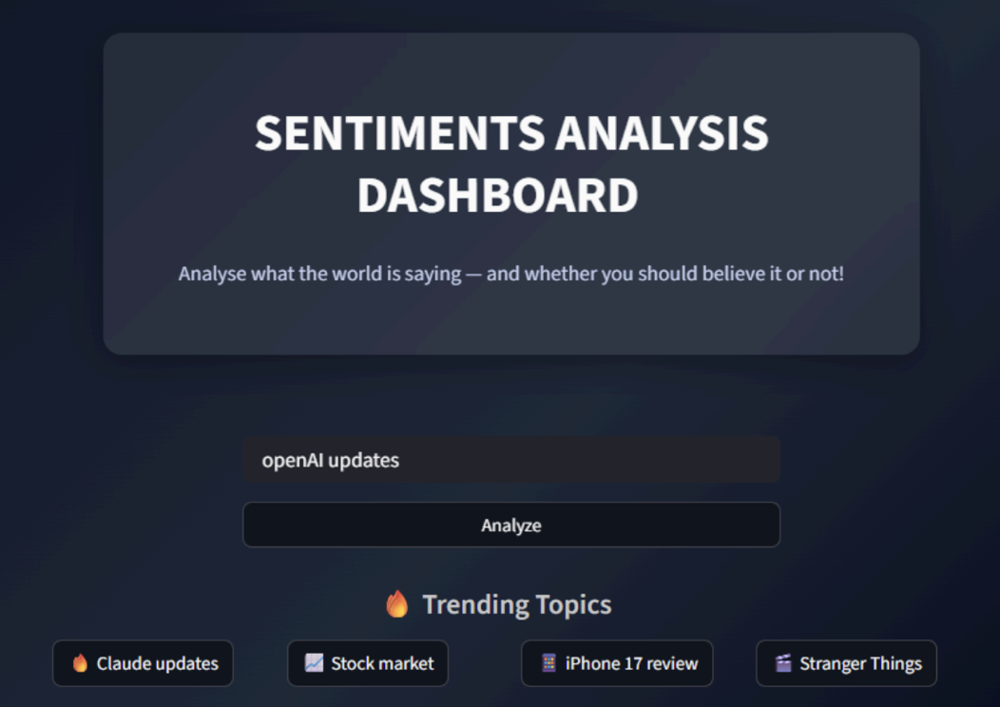
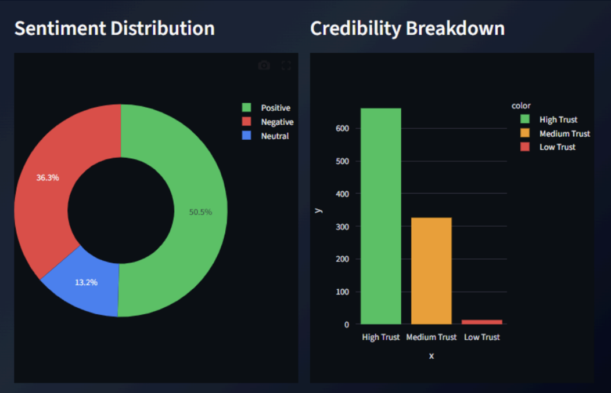
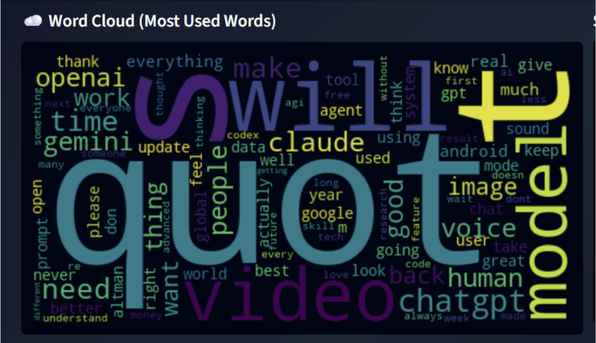
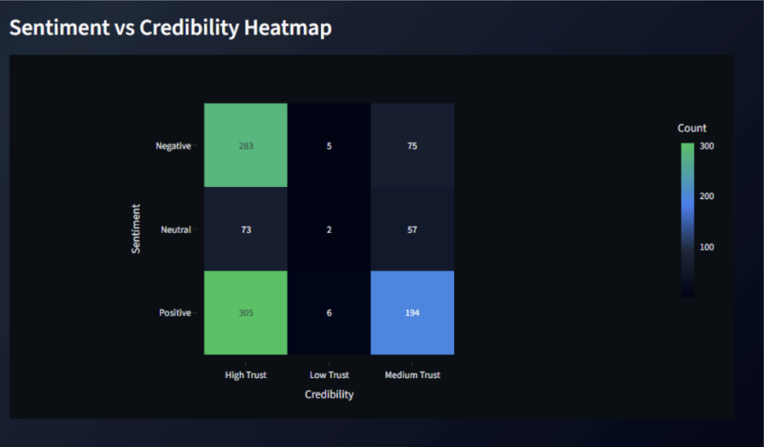
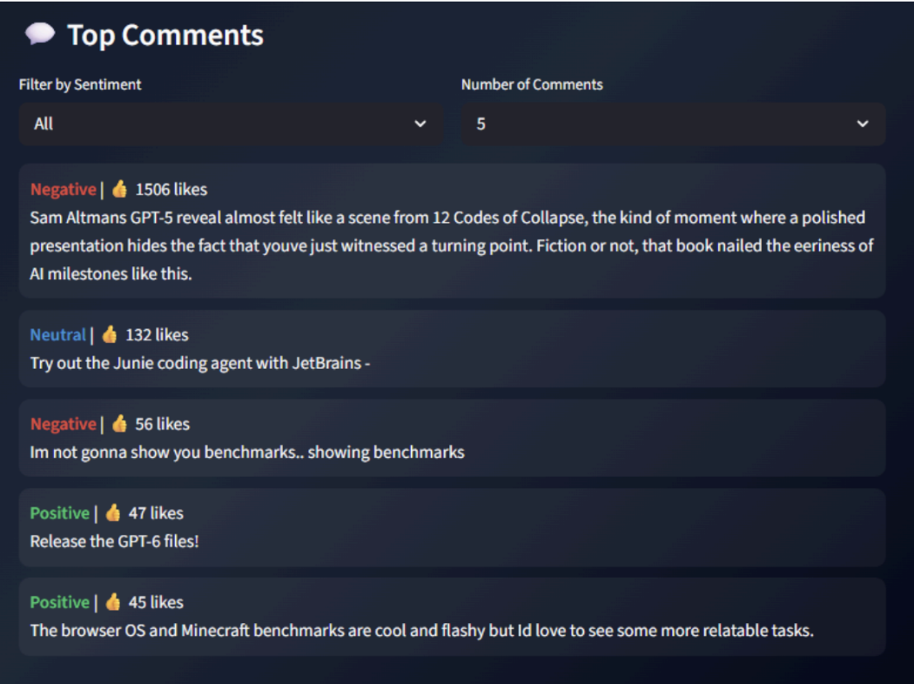

# 📊 Social Media Sentiment Analysis Dashboard

An AI-powered Social Media Sentiment Analysis Dashboard that analyzes public opinions from YouTube comments and classifies them into **Positive**, **Negative**, and **Neutral** sentiments. The project combines **Machine Learning**, **Natural Language Processing (NLP)**, and **Interactive Data Visualization** to transform raw social media data into actionable insights.

## 🚀 Features

* 🔍 Real-time YouTube comment analysis using YouTube Data API
* 🤖 Sentiment classification using Machine Learning
* 📝 Text preprocessing and cleaning pipeline
* 📈 Interactive Streamlit dashboard
* ☁️ Word Cloud generation
* 📊 Sentiment distribution visualization
* 🔥 Credibility scoring system for comments
* 📉 Sentiment vs Credibility Heatmap
* 🎯 Top comments filtering and exploration
* ⚡ Fast predictions using TF-IDF + Logistic Regression

---

## 🛠️ Tech Stack

### Frontend

* Streamlit

### Machine Learning & NLP

* Python
* Scikit-learn
* Logistic Regression
* TF-IDF Vectorization

### Data Sources

* Sentiment140 Dataset
* YouTube Data API

### Data Visualization

* Plotly
* Matplotlib
* Seaborn
* WordCloud

---

## 📂 Project Workflow

```text
YouTube API / Sentiment140 Dataset
                │
                ▼
      Data Preprocessing
                │
                ▼
       TF-IDF Vectorization
                │
                ▼
    Logistic Regression Model
                │
                ▼
      Sentiment Prediction
                │
                ▼
       Credibility Analysis
                │
                ▼
      Streamlit Dashboard
```

---

## 🧠 Machine Learning Pipeline

### 1. Data Collection

* Trained on the Sentiment140 dataset
* Fetches real-time comments using YouTube Data API

### 2. Data Preprocessing

* Lowercasing
* URL removal
* HTML tag removal
* Special character removal
* Whitespace normalization

### 3. Feature Extraction

* TF-IDF (Term Frequency-Inverse Document Frequency)

### 4. Model Training

* Logistic Regression Classifier
* Multi-class sentiment prediction:

  * Positive
  * Negative
  * Neutral

### 5. Credibility Analysis

Each comment is assigned a credibility score based on:

* Comment length
* Number of likes
* Spam indicators

Trust Levels:

* 🟢 High Trust
* 🟡 Medium Trust
* 🔴 Low Trust

---

## 📊 Dashboard Visualizations

### Overview Metrics

Displays:

* Total Comments
* Positive Sentiment %
* Negative Sentiment %
* Neutral Sentiment %

### Sentiment Distribution

Interactive pie chart showing overall sentiment breakdown.

### Credibility Breakdown

Bar chart visualizing trust levels of analyzed comments.

### Word Cloud

Highlights the most frequently used keywords.

### Sentiment vs Credibility Heatmap

Shows relationships between comment sentiment and trust levels.

### Top Comments Section

Allows filtering by:

* Sentiment Type
* Number of Comments
* Most Liked Comments

---

### 📸 Screenshots

### Landing Page



### Dashboard Overview



### Sentiment Distribution & Credibility Analysis


### Word Cloud



### Heatmap Analysis



### Top Comments



---

<!-- Add Screenshot Here -->

---

## ⚙️ Installation

### Clone the Repository

```bash
git clone https://github.com/your-username/social-media-sentiment-analysis.git
cd social-media-sentiment-analysis
```

### Create Virtual Environment

```bash
python -m venv venv
```

Activate:

```bash
# Windows
venv\Scripts\activate

# Mac/Linux
source venv/bin/activate
```

### Install Dependencies

```bash
pip install -r requirements.txt
```

### Configure API Key

Create a `.env` file:

```env
YOUTUBE_API_KEY=your_api_key_here
```

### Run the Application

```bash
streamlit run app.py
```

---

## 🎯 Use Cases

* Brand Monitoring
* Customer Feedback Analysis
* Product Review Analysis
* Market Research
* Public Opinion Tracking
* Content Creator Insights

---

## 🔮 Future Enhancements

* Support for Twitter/X and Reddit
* Deep Learning Models (LSTM, BERT)
* Multi-language Sentiment Analysis
* Emotion Detection
* Topic Modeling
* Historical Trend Analysis

---

## 👥 Team

* Sheen Sharma
* Amisha Mittal
* Harshita Saxena

---

## 📚 References

1. Sentiment140 Dataset
2. YouTube Data API
3. Scikit-learn Documentation
4. Streamlit Documentation

---

⭐ If you found this project useful, consider giving it a star!
